 

---

## About Me

Hi, I'm **Ahmed Mustayeen**, a **Computer Science (CS) student** exploring **machine learning, computer vision, and full-stack development**.

I like turning ideas into tools people can use: academic planning platforms, applications for university life, and experiments with deep learning and music generation.

- **Building:** student-focused web platforms and applied AI projects
- **Exploring:** visual recognition, generative models, and deep learning
- **Working with:** Python, TypeScript, JavaScript, PHP, and Jupyter notebooks
- **Aiming for:** clear code, reproducible experiments, and useful demos

---

## Featured Projects

<table>
  <tr>
    <td width="50%" valign="top">
      <h3>Unsupervised Music Generation</h3>
      
Deep learning system for multi-genre music generation.

      

        <code>LSTM AE</code>
        <code>VAE</code>
        <code>Transformer</code>
        <code>MAESTRO</code>
      

      <a href="https://github.com/Ahmedefti21/music-generation-unsupervised">View code</a>
    </td>
    <td width="50%" valign="top">
      <h3>Polaris</h3>
      
AI academic strategist for personalized admissions roadmaps.

      

        <code>TypeScript</code>
        <code>AI Planning</code>
        <code>EdTech</code>
      

      <a href="https://github.com/Ahmedefti21/Polaris">View code</a>
    </td>
  </tr>
  <tr>
    <td width="50%" valign="top">
      <h3>UniVerse</h3>
      
Academic and social platform for university students.

      

        <code>EJS</code>
        <code>Full-stack</code>
        <code>Collaboration</code>
      

      <a href="https://github.com/Dev-Tawfiq-Razeen-Efti-Tahmid/-UniVerse-A-Web-Based-Academic-and-Social-Ecosystem-for-Students">View code</a>
    </td>
    <td width="50%" valign="top">
      <h3>Hostel Management System</h3>
      
PHP system for hostel records and operations.

      

        <code>PHP</code>
        <code>CRUD</code>
        <code>Backend</code>
      

      <a href="https://github.com/Ahmedefti21/Hostel_Management_System">View code</a>
    </td>
  </tr>
</table>

---

## Tech Stack

### Languages

  

### Frameworks, Libraries, and Runtime

  

### Databases, Tools, and Platforms

  

---

## GitHub Stats

<!-- These cards are generated by .github/workflows/update-stats.yml. -->
<picture>
  <source media="(prefers-color-scheme: dark)" srcset="./profile/stats-dark.svg" />
  
</picture>
<picture>
  <source media="(prefers-color-scheme: dark)" srcset="./profile/top-langs-dark.svg" />
  
</picture>

Updated daily. Language percentages reflect repository code, not skill level.

### Contribution Arcade

<picture>
  <source media="(prefers-color-scheme: dark)" srcset="https://raw.githubusercontent.com/Ahmedefti21/Ahmedefti21/output/galaga-contribution-graph-dark.svg">
  <source media="(prefers-color-scheme: light)" srcset="https://raw.githubusercontent.com/Ahmedefti21/Ahmedefti21/output/galaga-contribution-graph.svg">
  
</picture>

---

## Currently Learning & Building

- **AI / ML:** stronger experiments, reproducible notebooks, and generative models
- **Computer vision:** recognition, segmentation, and practical OpenCV workflows
- **Full-stack development:** student-centered platforms and dashboards
- **Project craft:** clear documentation and demos that are easy to run

---

## Connect With Me

  
  

---

